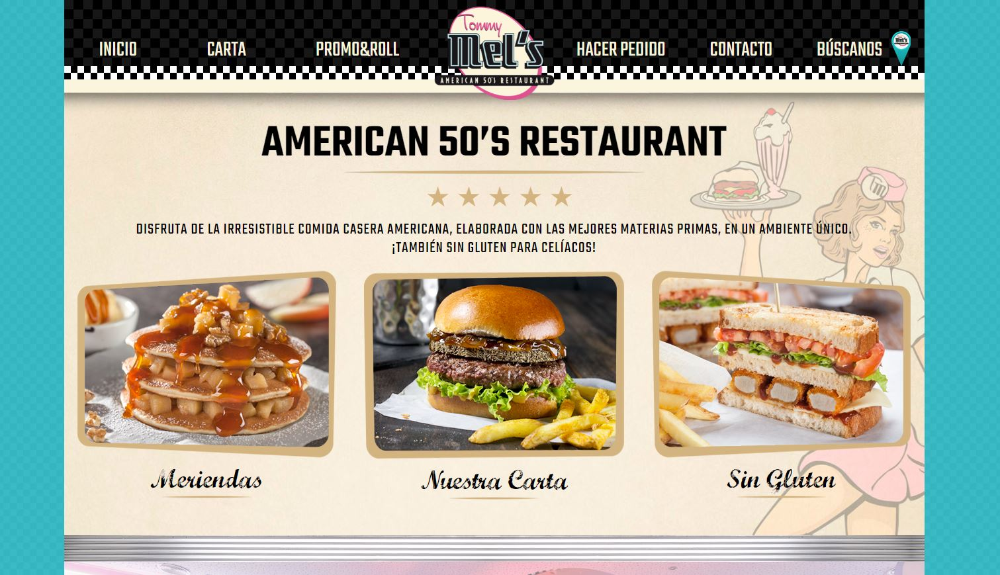
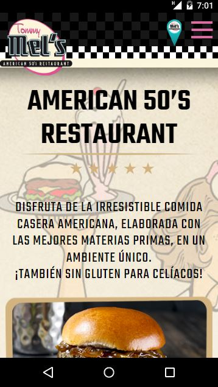
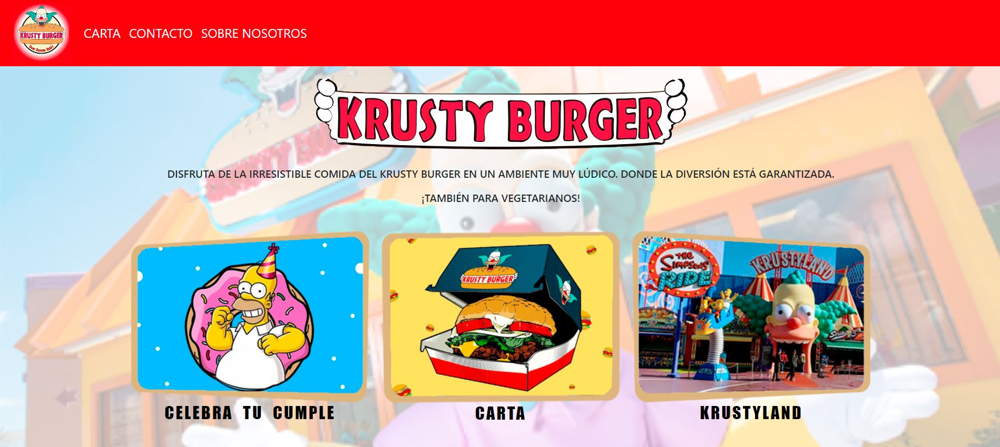
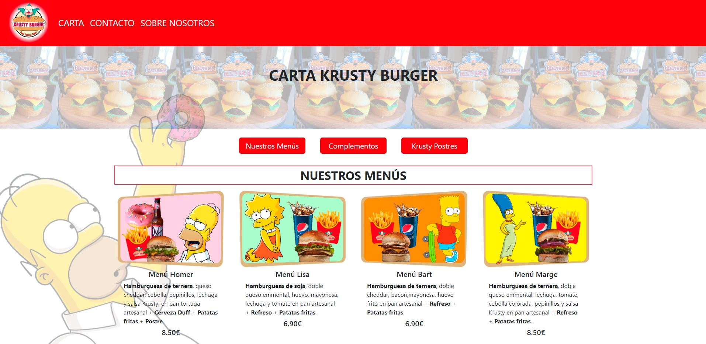
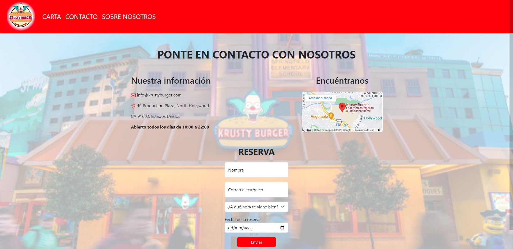
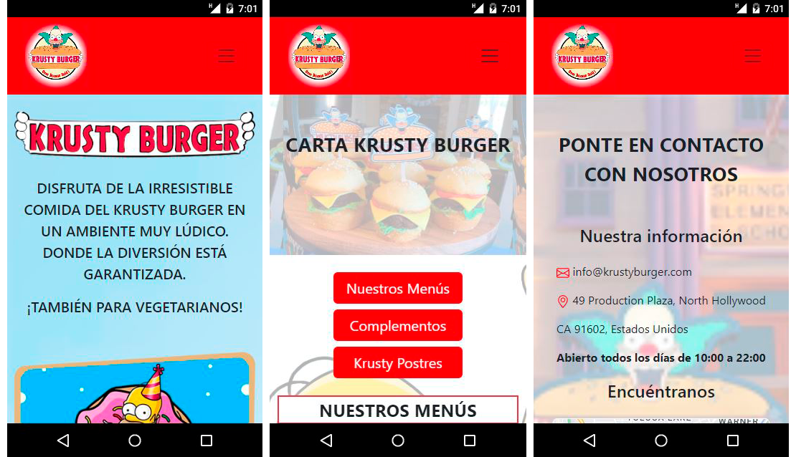

# Página web restaurante Krusty Burger

**Proyecto 1** - Restaurante Krusty Burger realizado con HTML5, CSS3 y Bootstrap.

Esta página web ha sido desarrollada por Hétor Mateu, como segundo proyecto del Bootcamp de Full Stack Developer de Geekshubs Academy.

El reto consistía en la creación de una página web para un restaurante. Esta debe contar con un mínimo de 3 páginas: Página de inicio, una carta y una página de contacto. Todas ellas deben estar conectadas entre sí y es de uso obligatorio la utilización de Bootstrap para la realización del diseño responsive.

Puedes ver el resultado desde la siguiente dirección: https://hmateu.github.io/krustyBurgerRestaurant/

## Tabla de contenidos
* [💻 Tecnologías utilizadas](#tecnologías-utilizadas)
* [💡 Referencias](#referencias)
* [:pick: Desarrollo](#desarrollo)
* [📃 Licencia y Copyright](#licencia-y-copyright)

### Tecnologías utilizadas
  
 

También se ha utilizado, para la creación de cada una de las imágenes que aparecen en el proyecto, el porgrama de edición: **Adobe Photoshop**.

### Referencias

Para la realización de la página web, me he inspirado en la de la famosa franquicia Tommy Mel's. Esta cadena de restaurantes nació en el año 2009 y cuenta con 37 locales, de los cuales dos tercios estás franquiciados.
Esta es la página de inicio de esta gran franquicia.
>

Y esta es la versión móvil.
>

### Desarrollo

Para la realización de este proyecto he utlizado HTML5, CSS3 y Bootstrap. Siendo este último de obligado uso para aprender su funcionamiento. Gracias al mismo, he conseguido una página web completamente responsive.

La página web cuenta con tres páginas plenamente funcionales, siendo estas la página principal, la de la carta (donde pueden ver los diferentes platos que se sirven) y la de contacto. A continuación, una captura de cada una de las páginas.

**Página de Inicio.**
>

**Página de Carta.**
>

**Página de Contacto.**
>

**En versión móvil.**
>

### Licencia y Copyright

* Este proyecto se ha realizado bajo la **licencia MIT**.
* El material multimedia utilizado para la realización de este proyecto, es propiedad de ***The Simpson***.